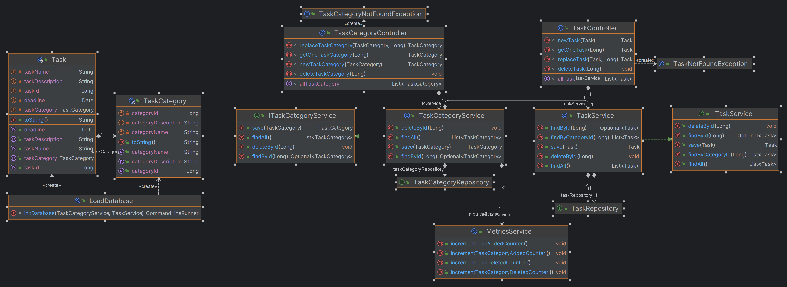
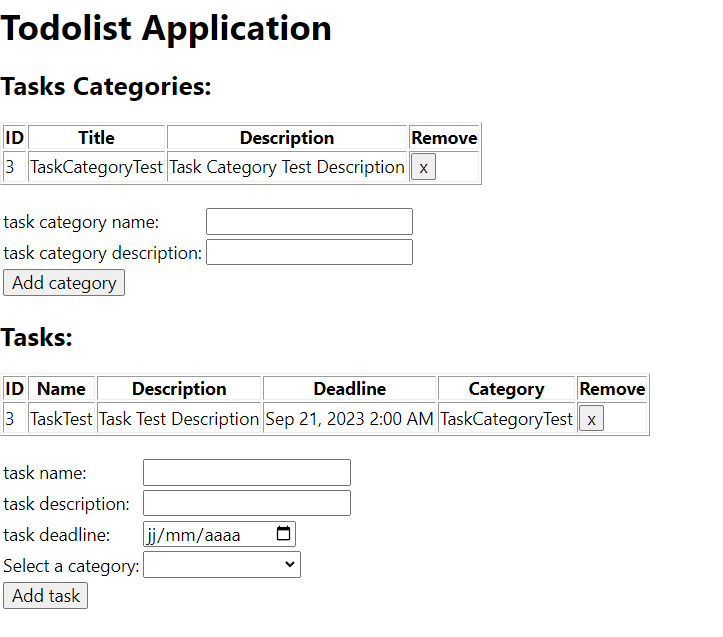
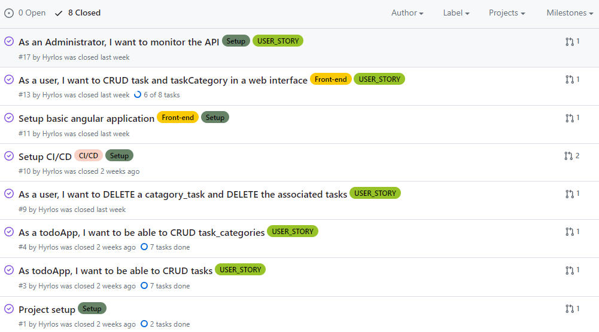

# CERN Todo web app

## Objective

This is a skeleton of Spring Boot application which should be used as a start point to create a working one.
The goal of this task is to create simple web application which allows users to create TODOs via REST API.

Below you may find a proposition of the DB model:

To complete the exercices please implement all missing classes and functonalites in order to be able to store and
retrieve information about tasks and their categories.
Once you are ready, please send it to me (ie link to your git repository) before our interview.

## Result

_Architecture Model (located at the end of the readme)_

My ToDo List REST API supports all CRUD (Create, Read, Update, and Delete) operations for both tasks and task
categories.

The architectural model I've implemented follows an Entity-Repository-Service-Controller structure.

To handle unexpected errors, I've implemented two exception classes: `TaskNotFound` and `TaskCategoryNotFound`.

The H2 database is created and populated programmatically. The `data.sql` table is generated from JPA entity classes,
according to the provided DB schema.

For quality assurance, I've included two test classes to ensure the proper functionality of the REST API.

I followed good practices in Git project management:

- Incorporating **User-stories** into the project (all are closed now):
  [User-Stories issues](https://github.com/Hyrlos/CERN_application_todo-web-app/issues?q=is%3Aissue+is%3Aclosed+label%3AUSER_STORY)

- Additionally, I've created several issues to facilitate the project setup (all are closed now):
  [Setup issues](https://github.com/Hyrlos/CERN_application_todo-web-app/issues?q=is%3Aissue+is%3Aclosed+label%3ASetup)

- Each issue was implemented through a **pull request** (or merge request for GitLab), each with its own dedicated
  branch (all merged now):
  [Pull requests](https://github.com/Hyrlos/CERN_application_todo-web-app/pulls?q=is%3Apr+is%3Aclosed)

To enhance code quality, I leverage IntelliJ's features, particularly focusing on minimizing warnings.
When working on controller development, I utilize IntelliJ's integrated HTTP requester to test the methods before
proceeding to develop the corresponding tests.

## To go further:

Some extra features were added:

- **A Frontend** in AngularJS and Typescript.
- **A CI/CD pipeline** to automate build and testing.
- **Metrics monitoring** with Actuator and Prometheus.

## Perspective:

More features could be added to the project:

- **Enhanced CI/CD**: for deployment and publishing.
- **Enhanced Testing**: Expanding the test suite to cover more scenarios, including exception handling and failure
  cases. End-to-end tests could also be used to test the front-end.
- **Include Grafana**: for better monitoring.
- **Docker Containerization**: Containerization with Docker improves project resilience, scalability, and portability.
  It simplifies deployment and ensures consistency across different environments.
- **Automated Code Reviews with SonarQube**: Integrating SonarQube into the CI/CD pipeline can help automate code
  reviews and identify code quality and security issues early in the development process.

## Launch the Application

After cloning the project:

- To launch the REST API, you can use Gradle with `bootRun`or the command `./gradlew bootRun`.
- To run the front-end, you can use your IDE or navigate to the front folder and execute `ng serve`.

## API Architecture Model

## Front-end

## Issues and CI/CD

It was an interesting project, and I tried to provide a good overview of my knowledge. 
I hope you will appreciate the work that has been done. 
I completed it during my free time, and now I need to continue working on my PhD thesis manuscript.