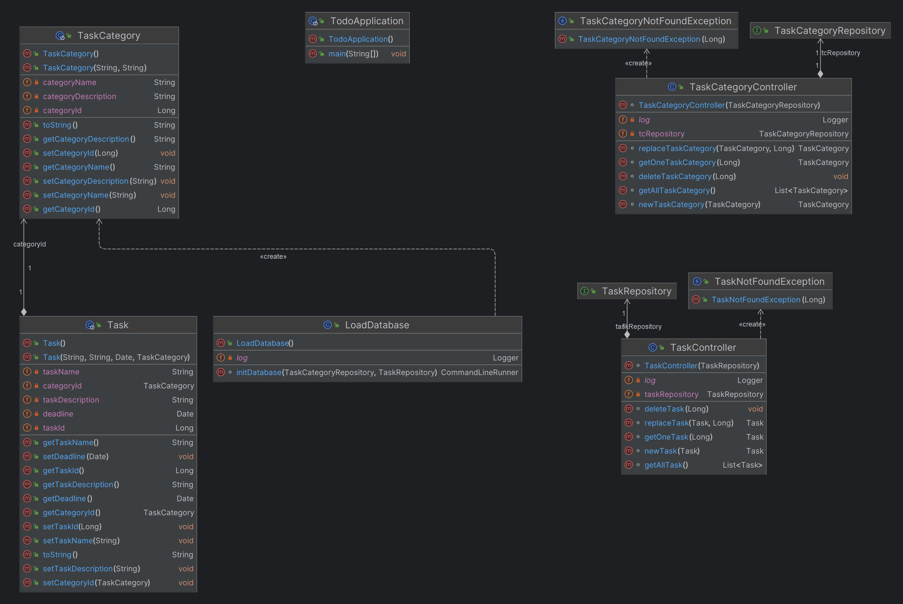

# CERN Todo web app

## Objective

This is a skeleton of Spring Boot application which should be used as a start point to create a working one.
The goal of this task is to create simple web application which allows users to create TODOs via REST API.

Below you may find a proposition of the DB model:

To complete the exercices please implement all missing classes and functonalites in order to be able to store and
retrieve information about tasks and their categories.
Once you are ready, please send it to me (ie link to your git repository) before our interview.

## Result

_Architecture model at the end of the readme_

My ToDo List REST API supports all CRUD (Create, Read, Update and Delete) operations for both tasks and task categories.

The architectural model I've implemented follows an Entity-Repository-Controller structure, without the service layer.
This choice is due to the simplicity of the application, which lacks core features.

To handle unexpected errors, I've implemented two exception classes: TaskNotFound and TaskCategoryNotFound.

The H2 database is created and populated programmatically, and the data.sql table is generated from JPA entity classes,
according to the provided DB schema.

For quality assurance, I've included two test classes to ensure the proper functionality of the REST API.

I followed best practices in Git project management, incorporating two user stories into the project:

- [As a server, I want to be able to CRUD task_categories  while requested](https://github.com/Hyrlos/CERN_application_todo-web-app/issues/4)
- [As a server, I want to be able to CRUD tasks while requested](https://github.com/Hyrlos/CERN_application_todo-web-app/issues/3)

Additionally, I've created an issue to facilitate the project setup:

- [Project setup](https://github.com/Hyrlos/CERN_application_todo-web-app/issues/1)

Each issue was implemented through a pull request, each with its own dedicated branch:

- [DB implementation](https://github.com/Hyrlos/CERN_application_todo-web-app/pull/2)
- [CRUD Task Category](https://github.com/Hyrlos/CERN_application_todo-web-app/pull/5)
- [CRUD Task](https://github.com/Hyrlos/CERN_application_todo-web-app/pull/6)

To enhance code quality, I leverage IntelliJ's features, particularly focusing on minimizing warnings.
When working on controller development, I utilize IntelliJ's integrated HTTP requester to test the methods before
proceeding to develop the corresponding tests.

## Prespective:

Many more work could be done on the project:

- **Implement a Frontend in AngularJS and Typescript**: Adding a frontend to the project can greatly enhance its
  usability.
- **Provide CI/CD through a .yml File**: Creating a CI/CD pipeline using a YAML file is a way to automatize build, test,
  deploy, and publish processes, making development and releases more efficient.
- **Enhance Testing**: Expanding the test suite to cover more scenarios, including exception handling and failure cases.
  End-2-end tests could be used is a front end is implemented.
- **Docker Containerization**: Containerization with Docker improve project resilience, scalability, and portability. It
  simplifies deployment and ensures consistency across different environments.
- **Automated Code Reviews with SonarQube**: Integrating SonarQube into the CI/CD pipeline can help automate code
  reviews and identify code quality and security issues early in the development process.

## Architecture Model

